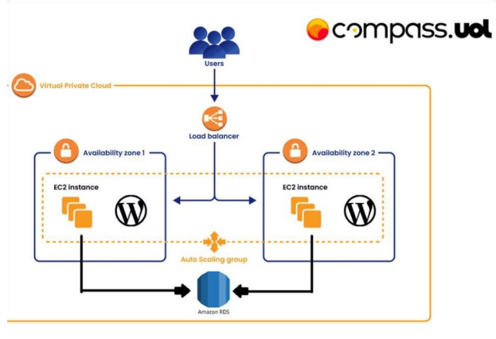

<h1 style="text-align: center">Atividade AWS - Docker</h1>

Atividade na qual deve ser criada uma aplicação baseada na arquiterura proposta, dentro da nuvem AWS e com foco no uso do Docker.

  <svg xmlns="http://www.w3.org/2000/svg" width="659" height="440" viewBox="0 0 659 440" fill="none" style="margin: -130px 0">
    <path
      d="M396.977 210.195C393.544 207.894 384.525 206.912 377.969 208.671C377.617 202.17 374.246 196.691 368.086 191.91L365.806 190.387L364.286 192.673C361.299 197.186 360.039 203.202 360.485 208.671C360.837 212.041 362.013 215.827 364.286 218.575C355.753 223.503 347.885 222.384 313.046 222.384H259.257C259.101 230.216 260.365 245.278 269.987 257.54C271.051 258.895 272.215 260.205 273.481 261.467C281.305 269.266 293.126 274.985 310.802 275C337.769 275.025 360.872 260.514 374.927 225.433C379.551 225.507 391.76 226.258 397.735 214.766C397.881 214.573 399.255 211.72 399.255 211.72L396.977 210.197V210.195ZM294.361 203.034H279.235V218.09H294.361V203.034ZM313.899 203.034H298.774V218.09H313.899V203.034ZM333.44 203.034H318.315V218.09H333.44V203.034ZM352.982 203.034H337.856V218.09H352.982V203.034ZM274.819 203.034H259.694V218.09H274.819V203.034ZM294.361 184.018H279.235V199.074H294.361V184.018ZM313.899 184.018H298.774V199.074H313.899V184.018ZM333.44 184.018H318.315V199.074H333.44V184.018ZM333.44 165H318.315V180.056H333.44V165Z"
      fill="#1D63ED" />
  </svg>
  <svg xmlns="http://www.w3.org/2000/svg" width="100" height="100" xmlns:xlink="http://www.w3.org/1999/xlink"
    version="1.1" id="Layer_1" x="0px" y="0px" viewBox="0 0 500 500" style="enable-background:new 0 0 304 182;"
    xml:space="preserve">
    <path
      style="width:100px;height:100px;font-size:431.92422485px;font-style:normal;font-weight:normal;fill:white;fill-opacity:1;stroke:none;stroke-width:1px;stroke-linecap:butt;stroke-linejoin:miter;stroke-opacity:1;font-family:Bitstream Vera Sans"
      d="M 241.99219,407.91016 L 241.99219,310.44922 L 144.72656,310.44922 L 144.72656,294.43359 L 241.99219,294.43359 L 241.99219,197.36328 L 257.61719,197.36328 L 257.61719,294.43359 L 355.27344,294.43359 L 355.27344,310.44922 L 257.61719,310.44922 L 257.61719,407.91016 L 241.99219,407.91016 z"
      id="text2464" />
  </svg>
  <svg xmlns="http://www.w3.org/2000/svg" width="144" height="144" xmlns:xlink="http://www.w3.org/1999/xlink"
    version="1.1" id="Layer_1" x="0px" y="0px" viewBox="0 0 304 182" style="enable-background:new 0 0 304 182;"
    xml:space="preserve">
    
    <svg>
      <path class="st0"
        d="M86.4,66.4c0,3.7,0.4,6.7,1.1,8.9c0.8,2.2,1.8,4.6,3.2,7.2c0.5,0.8,0.7,1.6,0.7,2.3c0,1-0.6,2-1.9,3l-6.3,4.2   c-0.9,0.6-1.8,0.9-2.6,0.9c-1,0-2-0.5-3-1.4C76.2,90,75,88.4,74,86.8c-1-1.7-2-3.6-3.1-5.9c-7.8,9.2-17.6,13.8-29.4,13.8   c-8.4,0-15.1-2.4-20-7.2c-4.9-4.8-7.4-11.2-7.4-19.2c0-8.5,3-15.4,9.1-20.6c6.1-5.2,14.2-7.8,24.5-7.8c3.4,0,6.9,0.3,10.6,0.8   c3.7,0.5,7.5,1.3,11.5,2.2v-7.3c0-7.6-1.6-12.9-4.7-16c-3.2-3.1-8.6-4.6-16.3-4.6c-3.5,0-7.1,0.4-10.8,1.3c-3.7,0.9-7.3,2-10.8,3.4   c-1.6,0.7-2.8,1.1-3.5,1.3c-0.7,0.2-1.2,0.3-1.6,0.3c-1.4,0-2.1-1-2.1-3.1v-4.9c0-1.6,0.2-2.8,0.7-3.5c0.5-0.7,1.4-1.4,2.8-2.1   c3.5-1.8,7.7-3.3,12.6-4.5c4.9-1.3,10.1-1.9,15.6-1.9c11.9,0,20.6,2.7,26.2,8.1c5.5,5.4,8.3,13.6,8.3,24.6V66.4z M45.8,81.6   c3.3,0,6.7-0.6,10.3-1.8c3.6-1.2,6.8-3.4,9.5-6.4c1.6-1.9,2.8-4,3.4-6.4c0.6-2.4,1-5.3,1-8.7v-4.2c-2.9-0.7-6-1.3-9.2-1.7   c-3.2-0.4-6.3-0.6-9.4-0.6c-6.7,0-11.6,1.3-14.9,4c-3.3,2.7-4.9,6.5-4.9,11.5c0,4.7,1.2,8.2,3.7,10.6   C37.7,80.4,41.2,81.6,45.8,81.6z M126.1,92.4c-1.8,0-3-0.3-3.8-1c-0.8-0.6-1.5-2-2.1-3.9L96.7,10.2c-0.6-2-0.9-3.3-0.9-4   c0-1.6,0.8-2.5,2.4-2.5h9.8c1.9,0,3.2,0.3,3.9,1c0.8,0.6,1.4,2,2,3.9l16.8,66.2l15.6-66.2c0.5-2,1.1-3.3,1.9-3.9c0.8-0.6,2.2-1,4-1   h8c1.9,0,3.2,0.3,4,1c0.8,0.6,1.5,2,1.9,3.9l15.8,67l17.3-67c0.6-2,1.3-3.3,2-3.9c0.8-0.6,2.1-1,3.9-1h9.3c1.6,0,2.5,0.8,2.5,2.5   c0,0.5-0.1,1-0.2,1.6c-0.1,0.6-0.3,1.4-0.7,2.5l-24.1,77.3c-0.6,2-1.3,3.3-2.1,3.9c-0.8,0.6-2.1,1-3.8,1h-8.6c-1.9,0-3.2-0.3-4-1   c-0.8-0.7-1.5-2-1.9-4L156,23l-15.4,64.4c-0.5,2-1.1,3.3-1.9,4c-0.8,0.7-2.2,1-4,1H126.1z M254.6,95.1c-5.2,0-10.4-0.6-15.4-1.8   c-5-1.2-8.9-2.5-11.5-4c-1.6-0.9-2.7-1.9-3.1-2.8c-0.4-0.9-0.6-1.9-0.6-2.8v-5.1c0-2.1,0.8-3.1,2.3-3.1c0.6,0,1.2,0.1,1.8,0.3   c0.6,0.2,1.5,0.6,2.5,1c3.4,1.5,7.1,2.7,11,3.5c4,0.8,7.9,1.2,11.9,1.2c6.3,0,11.2-1.1,14.6-3.3c3.4-2.2,5.2-5.4,5.2-9.5   c0-2.8-0.9-5.1-2.7-7c-1.8-1.9-5.2-3.6-10.1-5.2L246,52c-7.3-2.3-12.7-5.7-16-10.2c-3.3-4.4-5-9.3-5-14.5c0-4.2,0.9-7.9,2.7-11.1   c1.8-3.2,4.2-6,7.2-8.2c3-2.3,6.4-4,10.4-5.2c4-1.2,8.2-1.7,12.6-1.7c2.2,0,4.5,0.1,6.7,0.4c2.3,0.3,4.4,0.7,6.5,1.1   c2,0.5,3.9,1,5.7,1.6c1.8,0.6,3.2,1.2,4.2,1.8c1.4,0.8,2.4,1.6,3,2.5c0.6,0.8,0.9,1.9,0.9,3.3v4.7c0,2.1-0.8,3.2-2.3,3.2   c-0.8,0-2.1-0.4-3.8-1.2c-5.7-2.6-12.1-3.9-19.2-3.9c-5.7,0-10.2,0.9-13.3,2.8c-3.1,1.9-4.7,4.8-4.7,8.9c0,2.8,1,5.2,3,7.1   c2,1.9,5.7,3.8,11,5.5l14.2,4.5c7.2,2.3,12.4,5.5,15.5,9.6c3.1,4.1,4.6,8.8,4.6,14c0,4.3-0.9,8.2-2.6,11.6   c-1.8,3.4-4.2,6.4-7.3,8.8c-3.1,2.5-6.8,4.3-11.1,5.6C264.4,94.4,259.7,95.1,254.6,95.1z" />
      <svg>
        <path class="st1"
          d="M273.5,143.7c-32.9,24.3-80.7,37.2-121.8,37.2c-57.6,0-109.5-21.3-148.7-56.7c-3.1-2.8-0.3-6.6,3.4-4.4    c42.4,24.6,94.7,39.5,148.8,39.5c36.5,0,76.6-7.6,113.5-23.2C274.2,133.6,278.9,139.7,273.5,143.7z" />
        <path class="st1"
          d="M287.2,128.1c-4.2-5.4-27.8-2.6-38.5-1.3c-3.2,0.4-3.7-2.4-0.8-4.5c18.8-13.2,49.7-9.4,53.3-5    c3.6,4.5-1,35.4-18.6,50.2c-2.7,2.3-5.3,1.1-4.1-1.9C282.5,155.7,291.4,133.4,287.2,128.1z" />
      </svg>
    </svg>
  </svg>

## Arquitetura proposta

## Setup
Antes de tudo, será necessário fazer os preparativos para que a aplicação possa ser hosteada. E o primeiro passo será a criação da VPC

### 1. instalação e configuração do DOCKER ou CONTAINERD no host EC2

<h3>2. Efetuar Deploy de uma aplicação Wordpress com: 
• container de aplicação 
• RDS database Mysql<h3>

### 3. configuração da utilização do serviço EFS AWS para estáticos do container de aplicação Wordpress

### 4. configuração do serviço de Load Balancer AWS para a aplicação Wordpress