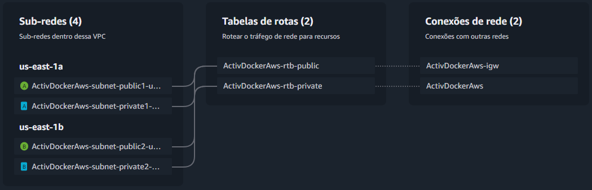

<h1 align="center">Atividade Docker e AWS</h1>

<p align="center">
Atividade na qual deve ser criada uma aplicação baseada na arquitetura proposta, dentro da nuvem AWS e com foco no uso do Docker.
</p>

<div align="center"></div>

## Arquitetura proposta
<div align=center></div>
Obeservando a imagem acima, é possível determinar os requerimentos da arquitetura, que são estes:

1. VPC
2. Load Balancer
3. Auto Scaling Group em 2 availability zones
4. Uma instância EC2 para cada availability zone
5. Wordpress instalado nas instâncias
6. Banco de dados RDS, que fornecerá os dados às instâcias EC2

### VPC
Como pode ser visto na arquitetura, será necessário criar o alicerce para que possamos realizar o deploy da nossa aplicação.

O que deve ser criado antes de tudo é a VPC, que será a base para montarmos um sistema de redes. Abaixo está o esquema de subnets, route tables e gateways:

<div align=center></div>

Aqui temos 2 subnets, 1 para cada availability zone. Para transferencia de dados entre as EC2 e o load balancer.

Ambas estão ligadas à tabela de rotas, que por sua vez está conectada ao internet gateway para possibilitar tráfego com a internet

---

### 1. instalação e configuração do DOCKER ou CONTAINERD no host EC2
* Ponto adicional para o trabalho utilizar a instalação via script de Start Instance (user_data.sh)

Primeiramente, devem ser criadas as instâncias EC2, que partirão de um modelo de instância, no qual foram utilizadas as seguintes especificações:

<div align="center">

|                   	|                      	|
|-------------------	|----------------------	|
|        AMI        	| Amazon Linux 2       	|
| Tipo de instância 	| t2.micro             	|
| Security group    	| ActivDockerAws-server |
| Armazenamento     	| 1 volume(s) - 8 GiB  	|

</div>

Para automatizar a instação do Docker e a inicialização do conteiner do Wordpress, será utilizado o seguinte script no user_data.sh:
```bash
#!/bin/bash

sudo yum install docker -y

sudo systemctl start docker
sudo systemctl enable docker

sudo usermod -aG docker ec2-user

sudo curl -L https://github.com/docker/compose/releases/latest/download/docker-compose-$(uname -s)-$(uname -m) -o /usr/local/bin/docker-compose

sudo chmod +x /usr/local/bin/docker-compose

cat <<EOF > /home/ec2-user/compose.yml
services:

  wordpress:
    image: wordpress
    restart: always
    ports:
      - 80:80
    environment:
      WORDPRESS_DB_HOST: activdockeraws-1.crwgcqugmfcm.us-east-1.rds.amazonaws.com
      WORDPRESS_DB_USER: admin
      WORDPRESS_DB_PASSWORD: Uj9b2qApzt89F8w7hL7d
      WORDPRESS_DB_NAME: activdockeraws
    volumes:
      - ./efs:/var/www/html
EOF

sudo mkdir efs

sudo mount -t nfs4 -o nfsvers=4.1,rsize=1048576,wsize=1048576,hard,timeo=600,retrans=2,noresvport fs-022330e490e708d36.efs.us-east-1.amazonaws.com:/ efs

docker-compose -f /home/ec2-user/compose.yml up -d
```
Este script faz as seguintes tarefas:
1. Instala o `Docker`
2. Inicializa o `Docker`
3. Adiciona o usuário `ec2-user` ao grupo `docker`
4. Instala o `docker-compose`
5. Dá permissão de execução para o `docker-compose`
6. Cria o `compose.yml`, que contém as instruções para subir o container do `Wordpress`
7. Cria o diretório de montagem para o `EFS`
8. Realiza a montagem do volume do `EFS` que será acessado pelo `Wordpress`
9. Executa o `docker-compose`, subindo o container do `Wordpress` na porta 80

---

<h3>2. Efetuar Deploy de uma aplicação Wordpress com:<br>
• container de aplicação<br>
• RDS database Mysql</h3>

O deploy do container de aplicação é efetuado assim que a instância entra em execução, aqui estão os logs do `Wordpress` recém criado.

<div align="center"></div>

**RDS database com MySQL**

<div align="center"></div>

**Realizando a conexão com algumas EC2**

<div align="center"></div>

### 3. Configuração da utilização do serviço EFS AWS para arquivos estáticos do container de aplicação Wordpress

**Elastic FIle System (EFS)**
<div align="center"></div>

Para anexar o `EFS`, basta utilizar o comando de montagem na instância `EC2`. Neste caso, foi utilizado o cliente do NFS. Para que possa ser montado o volume, é preciso que o diretório alvo já exista e tenha as permissões necessárias para tal.

<div align="center"></div>

No script fornecido para a inicialização da EC2, o volume do `Wordpress` já havia sido direcionado para o diretório de montagem do `EFS`.

Para conferir a conexão entre o `Wordpress` e o `EFS`, basta apenas checar as métricas do `EFS`.

<div align="center"></div>

Aqui podemos ver nas métricas do `EFS`, que foi realizada uma conexão, e essa conexão foi justamente a `EC2` que contém o conteiner do `Wordpress`

### 4. configuração do serviço de Load Balancer AWS para a aplicação Wordpress

*** ***TODO*** ***