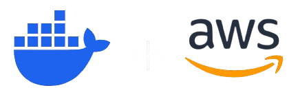
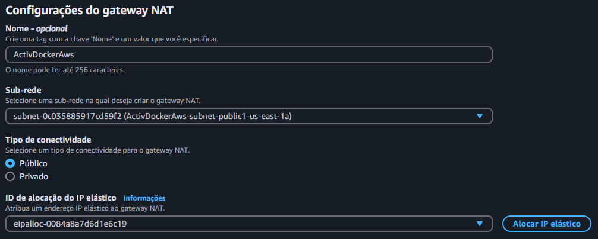
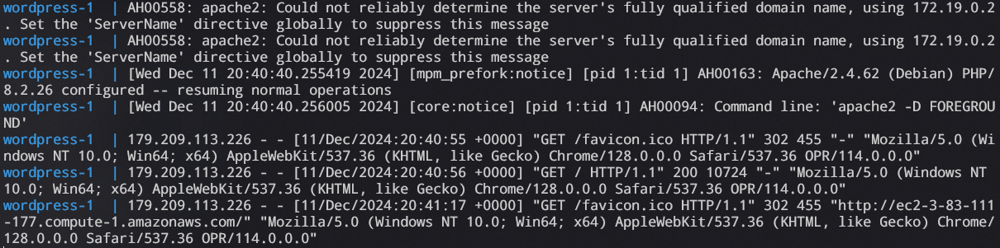
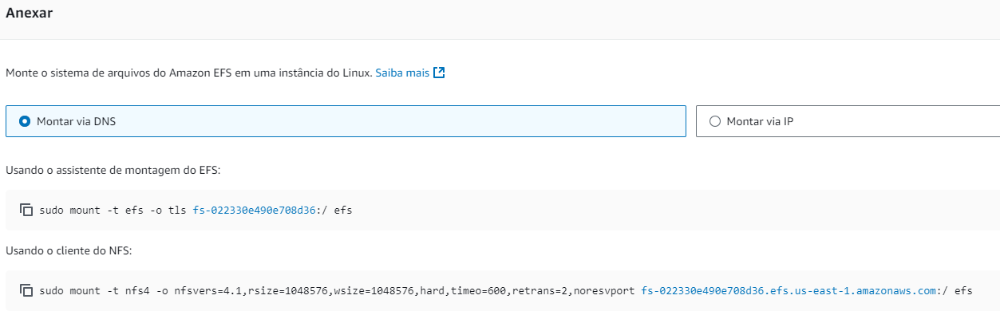
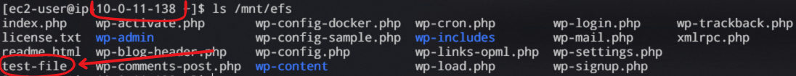
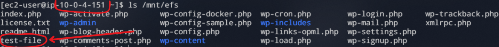
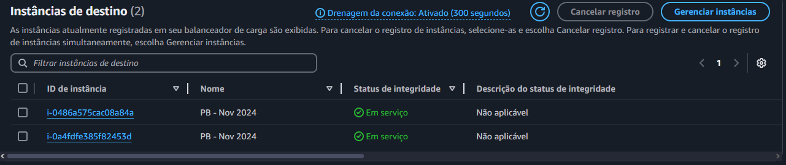

<h1 align="center">Atividade Docker e AWS</h1>

<p align="center">
Atividade na qual deve ser criada uma aplicação baseada na arquitetura proposta, dentro da nuvem AWS e com foco no uso do Docker.
</p>

<div align="center"></div>

## Arquitetura proposta
<div align=center></div>
Obeservando a imagem acima, é possível determinar os requerimentos da arquitetura, que são estes:

1. VPC
2. Load Balancer
3. Auto Scaling Group em 2 availability zones
4. Uma instância EC2 para cada availability zone
5. Wordpress instalado nas instâncias
6. Banco de dados RDS, que fornecerá os dados às instâcias EC2

### VPC
Como pode ser visto na arquitetura, será necessário criar o alicerce para que possamos realizar o deploy da aplicação.

O que deve ser criado antes de tudo é a VPC, que será a base para montarmos um sistema de redes. Abaixo está o esquema de subnets, route tables e gateways:

<div align=center></div>

Aqui temos 4 `subnets`, 2 para cada availability zone. 2 públicas para transferencia de dados entre o `Load Balancer` e a internet, e 2 privadas para transferencia de dados entre as `EC2` e o `Load Balancer`.

As `subnets` estão ligadas em suas respectivas `tabelas de rotas`.

A tabela de rotas pública está associada ao `Internet Gateway`, para que o `Load Balancer` possa ter acesso à internet. E a tabela de rotas privada está associada ao `NAT Gateway`, para rotear acesso à internet para as instâncias `EC2`, que estão em subnets privadas.

O `NAT Gateway` precisa estar associado à uma `subnet pública` e possuir um `IP Elástico` para funcionar corretamente.

---

### 1. instalação e configuração do DOCKER ou CONTAINERD no host EC2
* Ponto adicional para o trabalho utilizar a instalação via script de Start Instance (user_data.sh)

Primeiramente, devem ser criadas as instâncias EC2, que partirão de um modelo de instância, no qual foram utilizadas as seguintes especificações:

<div align="center">

|                   	|                      	|
|-------------------	|----------------------	|
|        AMI        	| Amazon Linux 2023    	|
| Tipo de instância 	| t2.micro             	|
| Security group    	| ActivDockerAws-server |
| Armazenamento     	| 1 volume(s) - 8 GiB  	|

</div>

Para automatizar a instação do Docker e a inicialização do conteiner do Wordpress, será utilizado o seguinte script no user_data.sh:
```bash
#!/bin/bash

sudo yum update -y

sudo yum install -y docker

sudo systemctl start docker
sudo systemctl enable docker

sudo usermod -aG docker ec2-user
newgrp docker

sudo curl -L https://github.com/docker/compose/releases/latest/download/docker-compose-$(uname -s)-$(uname -m) -o /usr/local/bin/docker-compose

sudo chmod +x /usr/local/bin/docker-compose

sudo mkdir /app

cat <<EOF > /app/compose.yml
services:

  wordpress:
    image: wordpress
    restart: always
    ports:
      - 80:80
    environment:
      WORDPRESS_DB_HOST: <RDS_ENDPOINT>
      WORDPRESS_DB_USER: <RDS_USER>
      WORDPRESS_DB_PASSWORD: <RDS_PASSWORD>
      WORDPRESS_DB_NAME: <RDS_DATABASE>
    volumes:
      - /mnt/efs:/var/www/html
EOF

sudo mkdir -p /mnt/efs

sudo mount -t nfs4 -o nfsvers=4.1,rsize=1048576,wsize=1048576,hard,timeo=600,retrans=2,noresvport fs-022330e490e708d36.efs.us-east-1.amazonaws.com:/ /mnt/efs

docker-compose -f /app/compose.yml up -d
```
Este script faz as seguintes tarefas:
1. Atualiza os pacotes do sistema
2. Instala o `Docker`
3. Inicializa o `Docker`
4. Adiciona o usuário `ec2-user` ao grupo `docker`
5. Instala o `docker-compose`
6. Dá permissão de execução para o `docker-compose`
7. Cria o diretório da aplicação
8. Cria o `compose.yml`, que contém as instruções para subir o container do `Wordpress`
9. Cria o diretório de montagem para o `EFS`
10. Realiza a montagem do volume do `EFS` que será acessado pelo `Wordpress`
11. Executa o `docker-compose`, subindo o container do `Wordpress` na porta 80

---

<h3>2. Efetuar Deploy de uma aplicação Wordpress com:<br>
• container de aplicação<br>
• RDS database Mysql</h3>

O deploy do container de aplicação é efetuado assim que a instância entra em execução, aqui estão os logs do `Wordpress` recém criado.

<div align="center"></div>

**RDS database com MySQL**

<div align="center"></div>

Garanta que os security groups das `EC2` e do `RDS` estão bem configurados:

* EC2:
  * outbound:
    * nome: ec2-rds-1
    * tipo: MYSQL/Aurora
    * porta: 3306
    * destino: rds-ec2-1
* RDS:
  * inbound:
    * nome: rds-ec2-1
    * tipo: MYSQL/Aurora
    * porta: 3306
    * destino: ec2-rds-1

**RDS conectado com as EC2**

<div align="center"></div>

**Bastion Host**

Caso haja algum problema dentro das instâncias, deve ser criado um `bastion host`. Um bastion host nada mais é do que uma intância com acesso público, que será a intermediadora para realizar o acesso via `SSH` às `EC2` da aplicação, que por sua vez estão protegidas em `subnets privadas`.

É importante salientar que o `bastion host` deve ter todas as precauções de segurança, visto que ele está exposto para acesso externo. Então utilize as melhores práticas de segurança para não tornar o `bastion host` em uma falha de segurança.

---

### 3. Configuração da utilização do serviço EFS AWS para arquivos estáticos do container de aplicação Wordpress

**Elastic FIle System (EFS)**
<div align="center"></div>

Para anexar o `EFS`, basta utilizar o comando de montagem na instância `EC2`. Neste caso, foi utilizado o cliente do NFS.

<div align="center"></div>

Assim como no `RDS`, garanta que os security groups das `EC2` e do `EFS` estejam bem configurados.

* EC2:
  * outbound:
    * nome: ec2-efs-1
    * tipo: NFS
    * porta: 2049
    * destino: efs-ec2-1
* EFS:
  * inbound:
    * nome: efs-ec2-1
    * tipo: NFS
    * porta: 2049
    * destino: ec2-efs-1

No script fornecido para a inicialização da `EC2`, o volume do `Wordpress` já havia sido direcionado para o diretório de montagem do `EFS`.

Para conferir a conexão entre o `Wordpress` e o `EFS`, basta apenas checar as métricas do `EFS`.

<div align="center"></div>

Aqui podemos ver nas métricas do `EFS`, que foi realizada uma conexão, e essa conexão foi justamente a `EC2` que contém o conteiner do `Wordpress`

Uma outra maneira mais interessante de checar o funcionamento do `EFS` é criando um arquivo em uma instância `EC2`, e ver se o arquivo também foi criado na montagem de outra `EC2`

```bash
sudo touch /mnt/efs/test-file
```
**EC2 1**
<div align="center"></div>

**EC2 2**
<div align="center"></div>

---

### 4. Configuração do serviço de Load Balancer AWS para a aplicação Wordpress

Com a aplicação `Wordpress` rodando e corretamente integrada ao RDS e EFS, chegou o momento configurar um `Load Balancer`.

**Resumo do Load Balancer**
<div align="center"></div>

**Health check**

O Load Balancer que foi utilizado é o `Classic Load Balancer`, que checa a integridade das instâncias recebendo um código 200 de uma requisição http no endpoint especificado, porém a aplicação `Wordpress` retorna uma requisição de código 302, que é um redirecionamento.

Para corrigir isso é muito simples, basta acessar o container do `Wordpress` utilizando `docker exec -it <CONTAINER_ID>` e criar um endpoint para ser o nosso `healthcheck`, que deve retornar código 200 na verificação.

Primeiramente devemos subir e acessar uma das instâncias EC2, e utilizar o comando `docker ps` para pegar o código do container Wordpress. Então acessamos o container e vemos o conteúdo dele

<div align="center"></div>

Adicionamos o código do endpoint do `healthcheck` utilizando `cat <<EOF >`

<div align="center"></div>

Saindo do container, podemos ver que o arquivo foi salvo no `EFS`

<div align="center"></div>

Checamos o novo endpoint fazendo uma requisição para outra `EC2` que também está rodando o `Wordpress`, e podemos ver que está retornando o código 200

<div align="center"></div>

**Auto Scaling Group**

Com o `Load Balancer` devidamente configurado, ele deve ser atribuído a um `Auto Scaling Group`, com as seguintes configurações abaixo:

* Tamanho do grupo
  * Capacidade desejada: 2
  * Capacidade mínima desejada: 2
  * Capacidade máxima desejada: 2
* Modelo de execução
  * Modelo de execução: ActivDockerAws
  * Versão: default
* Rede
  * Zonas de disponibilidade e sub-redes:
    * ActivDockerAws-subnet-private1-us-east-1a
    * ActivDockerAws-subnet-private2-us-east-1b
* Balanceamento de carga
  * Classic Load Balancers: ActivDockerAws
* Verificações de integridade
  * Ative as verificações de integridade do Elastic Load Balancing

O resto das configurações se mantém no valor padrão.

Após finalizar o `Auto Scaling Group`, basta esperar para que ele providencie as instâncias `EC2`. Até que as instâncias esterjam 100% prontas, pode demorar alguns minutos.

Passados alguns minutos, retornamos ao `Load Balancer` e conferimos as instâncias que foram cadastradas pelo `Auto Scaling Group`:

<div align="center"></div>

**Bônus: como atualizar o host name do Wordpress**

O `Wordpress` armazena o host name do `Load Balancer` quando ele é instalado, e redireciona as requisições para este host name, como o endpoint de `/login` por exemplo. Se o `Load Balancer` não possuir um domínio, então o seu host name será o DNS fornecido pela `AWS`. Porém se o `Load Balancer` original for derrubado, e criado um novo, o `Wordpress` continuará redirecionando para o DNS antigo, pois ele foi salvo como o host name nas configurações do `Wordpress`.

Para corrigir isso, deve ser utilizado o `bastion host` para acessar qualquer `EC2` da aplicação. Uma vez acessado, deve ser acessado o `container Docker` a partir do seguinte comando:
```bash
docker exec -it <CONTAINER_ID> bash
```

Utilizando o comando `ls` será listado os arquivos do `Wordpress`, incluindo o `healthcheck.php` criado anteriormente. O arquivo importante aqui é o `wp-config.php`.

Para alterá-lo, será necessário um editor de código, como um container Docker precisa ser enxuto, logo ele originalmente não possui nenhum editor, então será preciso instalar um.

Para instalar o `vim`, utilize os comandos:
```bash
apt update -y
apt install vim -y
```

Acesse o arquivo `wp-config.php` com o comando `vim wp-config.php`. É importante que ele seja acessado por um editor de código e não simplesmente sobrescrito utilizando `echo` ou `cat <<EOF >`, pois estes comandos leem alguns valores do código como variáveis de ambiente do sistema, e assim quebrando o código.

Dentro o arquivo, localize o comentário `/* That's all, stop editing! Happy publishing. */`. Acima deste comentário, escreva o seguinte código:
```php
if (isset($_SERVER['HTTP_HOST'])) {
    define('WP_HOME', 'http://' . $_SERVER['HTTP_HOST']);
    define('WP_SITEURL', 'http://' . $_SERVER['HTTP_HOST']);
}
```

Salve e saia do arquivo, utilize `cat wp-config.php` para conferir se está correto. 
Este código checa o host name da requisição HTTP, e se foi alterado, ele atribui o novo host name na URL do frontend do `Wordpress` (WP_HOME) e na URL da instalação do `Wordpress` (WP_SITEURL).

Após isso, saia e reinicie o container.

Agora o `DNS` de novos `Load Balancers` serão atribuídos às URLs do Wordpress.

---

**Finalização**

Após executar todos estes passos, temos uma aplicação `Wordpress` resiliente e escalável, com servidores em múltiplas zonas de disponibilidade, telorância à falhas, balanceamento de carga, banco de dados elástico e sistema de arquivos em nuvem.