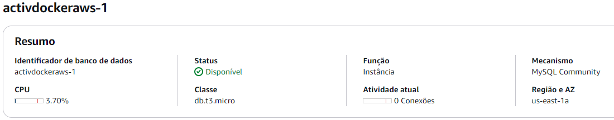

<h1 align="center">Atividade Docker e AWS</h1>

<p align="center">
Atividade na qual deve ser criada uma aplicação baseada na arquitetura proposta, dentro da nuvem AWS e com foco no uso do Docker.
</p>

<div align="center"></div>

## Arquitetura proposta
<div align=center></div>
Obeservando a imagem acima, é possível determinar os requerimentos da arquitetura, que são estes:

1. VPC
2. Load Balancer
3. Auto Scaling Group em 2 availability zones
4. Uma instância EC2 para cada availability zone
5. Wordpress instalado nas instâncias
6. Banco de dados RDS, que fornecerá os dados às instâcias EC2

### VPC
Como pode ser visto na arquitetura, será necessário criar o alicerce para que possamos realizar o deploy da nossa aplicação.

O que deve ser criado antes de tudo é a VPC, que será a base para montarmos um sistema de redes. Abaixo está o esquema de subnets, route tables e gateways:

<div align=center></div>

Aqui temos 2 subnets, 1 para cada availability zone. Para transferencia de dados entre as EC2 e o load balancer.

Ambas estão ligadas à tabela de rotas, que por sua vez está conectada ao internet gateway para possibilitar tráfego com a internet

#### Security groups
Foram criados 3 security groups, um para a trafego externo, um para trafego entre o load balancer e a instância EC2, e um para trafego entre a instância e o RDS. Abaixo está cada um deles:

* **ActivDockerAws (Load Balancer)**

<div align="center"></div>
<div align="center"></div>

* **ActivDockerAws-server (EC2)**

<div align="center"></div>
<div align="center"></div>

* **ActivDockerAws-MySQL (RDS)**

********** ***TODO*** ************

<div align="center"></div>
<div align="center"></div>

********** ***TODO*** ************

---

### 1. instalação e configuração do DOCKER ou CONTAINERD no host EC2
* Ponto adicional para o trabalho utilizar a instalação via script de Start Instance (user_data.sh)

Primeiramente, devem ser criadas as instâncias EC2, que partirão de um modelo de instância, no qual foram utilizadas as seguintes especificações:

<div align="center">

|                   	|                      	|
|-------------------	|----------------------	|
|        AMI        	| Amazon Linux 2       	|
| Tipo de instância 	| t2.micro             	|
| Security group    	| ActivDockerAws-server |
| Armazenamento     	| 1 volume(s) - 8 GiB  	|

</div>

Para automatizar a instação do Docker e a inicialização do conteiner do Wordpress, será utilizado o seguinte script no user_data.sh:
```bash
#!/bin/bash

sudo yum update -y

sudo amazon-linux-extras enable docker
sudo yum install docker -y

sudo systemctl start docker
sudo systemctl enable docker

sudo usermod -aG docker ec2-user

cat <<EOF > compose.yml
version: '3.1'

services:

  wordpress:
    image: wordpress
    restart: always
    ports:
      - 80:80
    environment:
      WORDPRESS_DB_HOST: activdockeraws-1
      WORDPRESS_DB_USER: admin
      WORDPRESS_DB_PASSWORD: 5ggMlbY18oUTWKt
      WORDPRESS_DB_NAME: wordpress
    volumes:
      - wordpress:/var/www/html

volumes:
  wordpress:
EOF

sudo curl -L https://github.com/docker/compose/releases/latest/download/docker-compose-$(uname -s)-$(uname -m) -o /usr/local/bin/docker-compose

sudo chmod +x /usr/local/bin/docker-compose

docker-compose up
```

A arquitetura propõe o uso de uma instância para cada availability zone, por isso deve ser usado um modelo de instância, em vez de criar as instâncias diretamente, o trabalho de subir as instâncias será atribuído ao auto scaling group. As instâncias são idênticas, com a única diferença sendo a availability zone e a respectiva subnet que está atrelada àquela availability zone.


<h3>2. Efetuar Deploy de uma aplicação Wordpress com:<br>
• container de aplicação<br>
• RDS database Mysql<h3>

O deploy do container de aplicação é efetuado assim que a instância entra em execução, assim como está descrito no script que foi atribuído aos dados do usuário.

<div align="center"></div>

******** ***TODO*** ********

**RDS**

******** ***TODO*** ********

### 3. configuração da utilização do serviço EFS AWS para arquivos estáticos do container de aplicação Wordpress

### 4. configuração do serviço de Load Balancer AWS para a aplicação Wordpress
